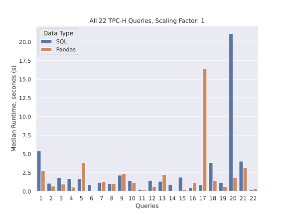

# Dataframe SQL Benchmark

## Current Comparison with SQL



## Tests for sql_to_pandas

Located in [sql_to_pandas/tests](sql_to_pandas/tests). Can be run with the following command:

```bash
conda activate sql_benchmark
cd sql_to_pandas/tests
python3 -m pytest
```

