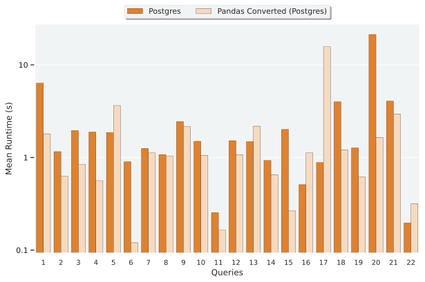
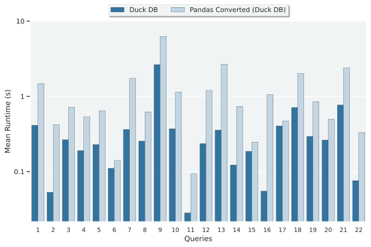
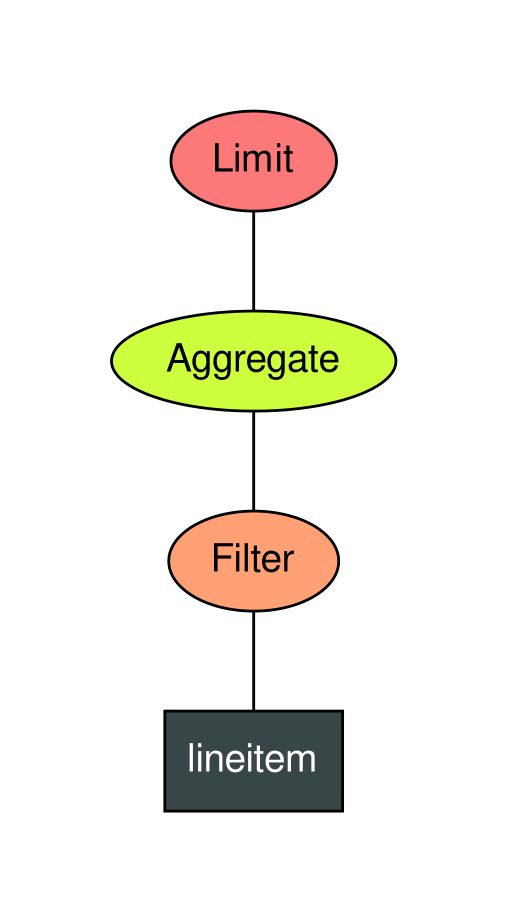
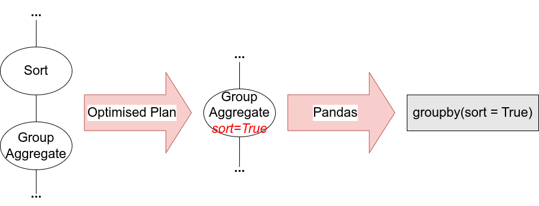

<!-- omit in toc -->
# Dataframe SQL Benchmark

<!-- omit in toc -->
## Postgres and Pandas from Postgres Query Plan in TPC-H



- Scaling Factor: 1
- 6 Runs with the first removed before creating the Mean

<!-- omit in toc -->
## DuckDB and Pandas from DuckDB Query Plan in TPC-H



- Scaling Factor: 1
- 6 Runs with the first removed before creating the Mean

<!-- omit in toc -->
##### Table of Contents

- [Setup](#setup)
  - [Getting DBGEN](#getting-dbgen)
  - [Setting up Postgres](#setting-up-postgres)
    - [Setting up the connection file for Postgres](#setting-up-the-connection-file-for-postgres)
    - [Installing Postgres and creating the Database](#installing-postgres-and-creating-the-database)
    - [Disable things in Postgres that we don't support](#disable-things-in-postgres-that-we-dont-support)
  - [Setting up DuckDB](#setting-up-duckdb)
  - [Setting up Python](#setting-up-python)
    - [Setup the Python environment](#setup-the-python-environment)
    - [Populate the Databases with data](#populate-the-databases-with-data)
- [Demos](#demos)
  - [Conversion demo](#conversion-demo)
    - [Postgres Query Plan](#postgres-query-plan)
    - [DuckDB Query Plan](#duckdb-query-plan)
    - [Converter flags](#converter-flags)
    - [Additional optimisations](#additional-optimisations)
  - [Benchmarker demo](#benchmarker-demo)
- [Tests for sql\_to\_pandas](#tests-for-sql_to_pandas)

## Setup
### Getting DBGEN

First, change to the root of the project directory.

Grab the DBgen version, clone this into the project directory.

```bash
git clone https://github.com/edin-dal/tpch-dbgen
cp tpch-dbgen/makefile .
```

Also, get gcc and make if you don't already have these

```bash
sudo apt-get install -y make gcc
```
### Setting up Postgres

#### Setting up the connection file for Postgres

The project comes included with a connection file: _database\_connection.json_

Here is the contents for it below, the Host and Port are the defaults:

```json
{
    "User": "benchmarker",
    "Password": "benchMugPassword",
    "Host": "localhost",
    "Port": "5432",
    "Database": "tpchdb"
}
```

You can change the Username, Password and Database name as you wish, but you have to use them below when setting up the databsae.

#### Installing Postgres and creating the Database

Install Postgres-14 (instructions for Ubuntu 22.04):

```bash
sudo apt update
sudo apt install postgresql postgresql-contrib -y
```

Change to the newly created postgres user:

```bash
sudo -i -u postgres
```

And check it's installed with:

```bash
psql -V
```

If this version is not Postgres 14.X, please install Postgres 14

Now we can create the table, use the same name as specified in your _database\_connection.json_ file. First enter the postgres shell, then create the database.

```bash
psql
CREATE DATABASE tpchdb;
```

Next, create the database user for our program (using the same username and password as the connection file) and grant it all permissions:

```bash
CREATE USER benchmarker WITH ENCRYPTED PASSWORD 'benchMugPassword';
GRANT ALL PRIVILEGES ON DATABASE tpchdb TO benchmarker;
```

<details>
<summary>Are you trying to use your newly created user on an existing table, run these commands</summary>


Assuming your user is: _benchmarker_.

```bash
GRANT ALL PRIVILEGES ON ALL TABLES IN SCHEMA public TO benchmarker;
GRANT ALL PRIVILEGES ON ALL SEQUENCES IN SCHEMA public TO benchmarker;


ALTER DEFAULT PRIVILEGES FOR USER benchmarker IN SCHEMA public GRANT SELECT, INSERT, UPDATE, DELETE ON TABLES TO benchmarker;
```
</details>

#### Disable things in Postgres that we don't support

We need to disable some things in the Postgres planner that we don't have support for. To do this, first in the Postgres shell we can find the location of the config file. And then we can edit it:
```bash
SHOW config_file;
exit
vim /var/lib/pgsql/14/data/postgresql.conf
```

We don't have support for parallelisation, bitmap scans, memoize or nested loops, so we turn these off by changing the following lines, take out the comment at the beginning. If you don't have some of these options that's okay:

```bash
max_parallel_workers_per_gather = 0
max_parallel_maintenance_workers = 0
max_parallel_workers = 0
enable_bitmapscan = off
enable_memoize = off
enable_nestloop = off
```

Then restart the postgres server with the following commands, change the postgres service name as necessary. To find the postgresql "service", please run the below command:

```bash
systemctl --type=service | grep "postgresql"
```

```bash
systemctl restart postgresql-14
systemctl status postgresql-14
```

The second command should inform whether the database has come back up

### Setting up DuckDB

As DuckDB is an embedded DBMS, installation is made super easy. It comes with the Conda environment. So just follow the steps below to setup Python and Conda.

### Setting up Python

This project requires python version 3.10 or higher, check this by running:

```bash
python --version
```

Then install the corresponding version of the Conda package manager, using the below link:

[Conda installation guide](https://docs.conda.io/projects/conda/en/latest/user-guide/install/linux.html)

#### Setup the Python environment

Back in the root directory of this project, we now need to setup the conda environment for the project (this provides us all the dependencies):

```bash
conda env create -n sql_benchmark --file environment.yml
conda activate sql_benchmark
```

And the second command activates it for us.

#### Populate the Databases with data

With Postgres installed and our Postgres database existing, the next step is to populate our databasse. Run the following command in the root of the project directory, or customise the parameters:

```bash
python3 benchmarking/prepare_databases.py --verbose True --data_storage data_storage --db_gen tpch-dbgen --scaling_factor 1 --postgres_connection postgres_connection.json --duck_db_connection duckdb_tpch.duckdb --constants tpch-prep
```

The supplied parameters create/initialise the following:
- A directory called *data_storage* in the root of the directory containing the data for the TPC-H benchmark suite with scaling factor *1*
- A postgres database, with the connection details as specified, full of the same data from *data_storage*
- A DuckDB database, called *duckdb_tpch.duckdb*, full of the data also found in *data_storage*

You can even just create one form of the data, with the parameter: *--run_only*
For instance, to create only Duck DB, one would run: *... --run_only 'DuckDB'*

## Demos

### Conversion demo

#### Postgres Query Plan 

Assuming you have completed all the setup, you can now run the command below to generate the Pandas code for Query 6 from the corresponding PostgreSQL query plan :

```bash
conda activate sql_benchmark
python3 sql_to_pandas/sql_to_pandas.py --file sql_to_pandas/queries/6.sql --output_location postgres_query_6 --name q6_pandas.py --query_planner Postgres --planner_file postgres_connection.json 
```

This will run the *6.sql* file in the Postgres database we have created prior, retrieve a query plan and then convert this query plan to Pandas. By default the tool creates diagrams of each of the query plans it encounters, Pandas tree for Query 6 may look similar to this:



#### DuckDB Query Plan

If we want to plan the query with the Duck DB query planner, we can use the following query:

```bash
conda activate sql_benchmark
python3 sql_to_pandas/sql_to_pandas.py --file sql_to_pandas/queries/6.sql --output_location duck_query_6 --name q6_pandas.py --query_planner Duck_DB --planner_file duckdb_tpch.duckdb 
```

This will produce Pandas code that will look pretty much identical to this below:

```python
df_filter_1 = lineitem[(lineitem.l_shipdate>='1994-01-01') & (lineitem.l_shipdate<'1995-01-01') & (~lineitem.l_shipdate.isnull()) & (lineitem.l_discount>=0.050) & (lineitem.l_discount<=0.070) & (~lineitem.l_discount.isnull()) & (lineitem.l_quantity<24) & (~lineitem.l_quantity.isnull())]
df_filter_1 = df_filter_1[['l_shipdate', 'l_discount', 'l_quantity', 'l_extendedprice']]
df_aggr_1 = pd.DataFrame()
df_aggr_1['l_extendedpricel_discount'] = ((df_filter_1.l_extendedprice) * (df_filter_1.l_discount))
df_aggr_1 = df_aggr_1[['l_extendedpricel_discount']]
df_aggr_2 = pd.DataFrame()
df_aggr_2['revenue'] = [(df_aggr_1.l_extendedpricel_discount).sum()]
df_aggr_2 = df_aggr_2[['revenue']]
df_limit_1 = df_aggr_2.head(1)
```

#### Converter flags

We provide the following additional flags for user convenience, we will explain each of these in turn, to set them just pass them in set to true

- `column_ordering`, Whether we would like our column ordering in the final returned DataFrame to be perfectly accurate or not. Has significant impact on run-time.
- `column_limiting`, Whether we would like our columns between nodes to not have all DBMS specified projections, can help with ongoing memory usage.
- `benchmarking`, Setting this to true greatly reduces the amount of program output - reducing it to only what is strictly required for operation.

#### Additional optimisations

I have also created functionality to use various optimisation options. There are many of these but one such option, that can have a 40% performance improvement in some cases is to use Numpy for the execution of CASE queries. We can do this by adding the argument to the end of the command:

```bash
--use_numpy True
```



The other two optimisations are both 'fusion optimisations', these allow us to combine nodes that can be nested within each other. See the image above for an explanation. We can do this for group aggregate and sort, as well as merge join and sort. To use these, set the below arguments:

```bash
--groupby_sort_fusion True
--merge_join_sort_fusion True
```

### Benchmarker demo

The repository also comes with a custom benchmarking tool. This has been specifically designed to properly gauge runtime and verify correctness for each and every value of every record. The tool provides reproducability by using "test specification" files so that tests are modular and so easy to write.

To use the benchmarking tool to run comparison for all queries, converted to Postgres and DuckDB, run the below command:

```bash
conda activate sql_benchmark
python3 benchmarking/run_benchmarking.py --file benchmarking/test_specifications/pg_duck_tpch.json --verbose
```

This command will run through the test specification file, *pg_duck_tpch.json*, and output the timing and correctness results as specified in the file.

I also provide various other test specifications, including ones to compare queries when we have different scaling factors (**scaling_test.json**) or ones to output all converted queries in a handy file (for Postgres: **pg_tpch.json**, for Duck DB: **duck_tpch.json**).

## Tests for sql_to_pandas

Located in [sql_to_pandas/tests](sql_to_pandas/tests). Can be run with the following command:

```bash
conda activate sql_benchmark
cd sql_to_pandas/tests
python3 -m pytest
```
