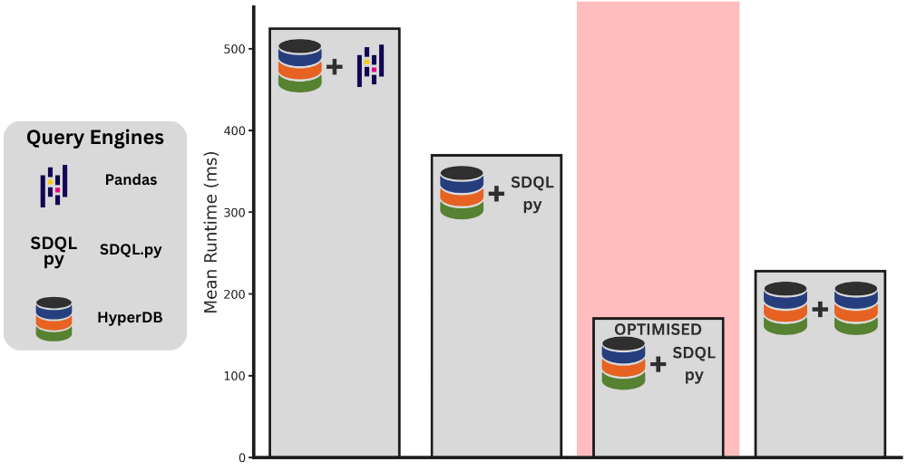

# QueryBridge

QueryBridge was created as the core contribution of my Undergraduate Dissertation, this was a third of my credit load in each of the final two years of my 5-year integrated Masters degree ([Year 1](http://www.drps.ed.ac.uk/23-24/dpt/cxinfr10051.htm), [Year 2](http://www.drps.ed.ac.uk/23-24/dpt/cxinfr11093.htm)). 

QueryBridge formed part of the following publication: _Efficient Query Processing in Python Using Compilation. Hesam Shahrokhi, **Callum Groeger**, Yizhuo Yang, Amir Shaikhha (SIGMOD '23)_. And in it's second year, I was able to win First Place at Student Research Competition (Undergraduate Category) in the International Conference on Code Generation and Optimization ([CGO’24](https://conf.researchr.org/track/cgo-2024/cgo-2024-student-research-competition#About)). Finally, this performance meant the work was also accepted to the ACM Student Research Competition Grand Final. This year-long competition features work from top students across 19 major ACM conferences.

## What is QueryBridge?

QueryBridge addresses challenges faced by data scientists and database researchers by providing a comprehensive solution to convert between different execution formats. QueryBridge can apply high-level optimisations to DataFrame-API (Pandas) code, giving data scientists a better development experience over SQL. This also provides database researchers with a fair comparison of a databases' query planning abilities.

QueryBridge can also produce execution code in a compiled language which is significantly faster than Pandas, solving data scientists' performance issues with DataFrame-API languages. Finally, QueryBridge offers universal and language-level optimisations that enable the compiled language to outperform a state of the art database by a substantial margin.

## What results did QueryBridge obtain?

Creating the QueryBridge tool enabled many different tests to be carried out. For simplicity sake, I will highlight just one in the above figure. This figure demonstrates the mean query runtime across the TPC-H benchmark when Hyper DB plans the query and different query engines execute that plan. 

We see that using [SDQL.py](https://github.com/edin-dal/sdqlpy) over Pandas results in a **29.6%** reduction in runtime. This is achieved through converting the query plan using QueryBridge. However, this is worse than when Hyper DB plans and executes the query itself (rightmost bar). So to achieve state of the art performance, I apply four different optimistion approaches to the query plan and again generate SDQL.py - this is highlighted red in the figure. This beats state of the art by **1.34x**, a significant result, and a key contribution of my framework and of the optimisations it offers. 

## How can I use it?

Full installation instructions can be found in the [installation file](INSTALL.md).
