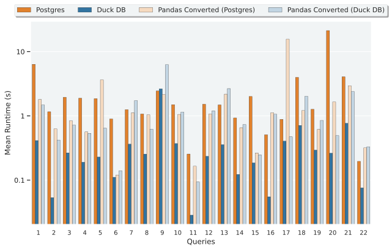

# Dataframe SQL Benchmark {ignore=True}


## Postgres, Duck DB and Converted Pandas in TPCH-H {ignore=True}



- Scaling Factor: 1
- 6 Runs with the first removed before creating the Mean

##### Table of Contents {ignore=True}
<!-- @import "[TOC]" {cmd="toc" depthFrom=1 depthTo=6 orderedList=false} -->

<!-- code_chunk_output -->

- [Setup](#-setup)
  - [Getting DBGEN](#-getting-dbgen)
  - [Setting up Postgres](#-setting-up-postgres)
    - [Setting up the connection file for Postgres](#-setting-up-the-connection-file-for-postgres)
    - [Installing Postgres and creating the Database](#-installing-postgres-and-creating-the-database)
    - [Disable things in Postgres that we don't support](#-disable-things-in-postgres-that-we-dont-support)
  - [Setting up DuckDB](#-setting-up-duckdb)
  - [Setting up Python](#-setting-up-python)
    - [Setup the Python environment](#-setup-the-python-environment)
    - [Populate the Postgres Database with data](#-populate-the-postgres-database-with-data)
- [Demos](#-demos)
  - [Conversion demo](#-conversion-demo)
  - [Benchmarker demo](#-benchmarker-demo)
- [Tests for sql_to_pandas](#-tests-for-sql_to_pandas)
- [Pending Code tasks](#-pending-code-tasks)
  - [Distant future](#-distant-future)

<!-- /code_chunk_output -->

## Setup
### Getting DBGEN

First, change to the root of the project directory.

Grab the DBgen version, clone this into the project directory.

```bash
git clone https://github.com/edin-dal/tpch-dbgen
cp tpch-dbgen/makefile .
```

Also, get gcc and make if you don't already have these

```bash
sudo apt-get install -y make gcc
```
### Setting up Postgres

#### Setting up the connection file for Postgres

The project comes included with a connection file: _database\_connection.json_

Here is the contents for it below, the Host and Port are the defaults:

```json
{
    "User": "benchmarker",
    "Password": "benchMugPassword",
    "Host": "localhost",
    "Port": "5432",
    "Database": "tpchdb"
}
```

You can change the Username, Password and Database name as you wish, but you have to use them below when setting up the databsae.

#### Installing Postgres and creating the Database

Install Postgres-14 (instructions for Ubuntu 22.04):

```bash
sudo apt update
sudo apt install postgresql postgresql-contrib -y
```

Change to the newly created postgres user:

```bash
sudo -i -u postgres
```

And check it's installed with:

```bash
psql -V
```

If this version is not Postgres 14.X, please install Postgres 14

Now we can create the table, use the same name as specified in your _database\_connection.json_ file. First enter the postgres shell, then create the database.

```bash
psql
CREATE DATABASE tpchdb;
```

Next, create the database user for our program (using the same username and password as the connection file) and grant it all permissions:

```bash
CREATE USER benchmarker WITH ENCRYPTED PASSWORD 'benchMugPassword';
GRANT ALL PRIVILEGES ON DATABASE tpchdb TO benchmarker;
```

<details>
<summary>Are you trying to use your newly created user on an existing table, run these commands</summary>


Assuming your user is: _benchmarker_.

```bash
GRANT ALL PRIVILEGES ON ALL TABLES IN SCHEMA public TO benchmarker;
GRANT ALL PRIVILEGES ON ALL SEQUENCES IN SCHEMA public TO benchmarker;


ALTER DEFAULT PRIVILEGES FOR USER benchmarker IN SCHEMA public GRANT SELECT, INSERT, UPDATE, DELETE ON TABLES TO benchmarker;
```
</details>

#### Disable things in Postgres that we don't support

We need to disable some things in the Postgres planner that we don't have support for. To do this, first in the Postgres shell we can find the location of the config file. And then we can edit it:
```bash
SHOW config_file;
exit
vim /var/lib/pgsql/14/data/postgresql.conf
```

We don't have support for parallelisation, bitmap scans, memoize or nested loops, so we turn these off by changing the following lines, take out the comment at the beginning. If you don't have some of these options that's okay:

```bash
max_parallel_workers_per_gather = 0
max_parallel_maintenance_workers = 0
max_parallel_workers = 0
enable_bitmapscan = off
enable_memoize = off
enable_nestloop = off
```

Then restart the postgres server with the following commands, change the postgres service name as necessary. To find the postgresql "service", please run the below command:

```bash
systemctl --type=service | grep "postgresql"
```

```bash
systemctl restart postgresql-14
systemctl status postgresql-14
```

The second command should inform whether the database has come back up

### Setting up DuckDB

As DuckDB is an embedded DBMS, installation is made super easy.  

### Setting up Python

This project requires python version 3.10 or higher, check this by running:

```bash
python --version
```

Then install the corresponding version of the Conda package manager, using the below link:

[Guide](https://docs.conda.io/projects/conda/en/latest/user-guide/install/linux.html)

#### Setup the Python environment

Back in the root directory of this project, we now need to setup the conda environment for the project (this provides us all the dependencies):

```bash
conda env create -n sql_benchmark --file environment.yml
conda activate sql_benchmark
```

And the second command activates it for us.

#### Populate the Postgres Database with data

With Postgres setup and our database existing, the next step is to populate our database. Run the following command in the root of the project directory, or customise the parameters:

```bash
python3 sql_to_pandas/prepare_database.py --database_connection postgres_connection.json --scaling_factor 1 --db_gen tpch-dbgen --data_storage data_storage --constants tpch-prep
```

## Demos

### Conversion demo

Assuming you have completed the setup, you can now run the command below to generate the Pandas code for Query 6 from the SQL query plan (with all the diagrams):

```bash
conda activate sql_benchmark
python3 sql_to_pandas/sql_to_pandas.py --file sql_to_pandas/queries/6.sql --output_location query_6 --name generated_query_6_pandas.py --db_file postgres_connection.json --use_numpy False
```

### Benchmarker demo

To use the benchmarking tool to run all the queries, run the below command:

```bash
conda activate sql_benchmark
python3 benchmarking/run_benchmarking.py --file benchmarking/test_specifications/all_queries_test.json --verbose
```

## Tests for sql_to_pandas

Located in [sql_to_pandas/tests](sql_to_pandas/tests). Can be run with the following command:

```bash
conda activate sql_benchmark
cd sql_to_pandas/tests
python3 -m pytest
```

## Pending Code tasks

- **Aggregation Improvements:** Distinct, Count Distinct, CASE integration, Use Intermediate Results (useAlias) _(8h)_
- **Explain Tree:** Make classes capture all info automatically _(2h)_
- **Distinct:** Select Distinct Bug _(1h)_
- **Extract:** Make EXTRACT tests work _(4h)_
- **Expression Tree:** Make Minus a unary operator _(4h)_

### Distant future

- Set up CI
- Redo the function importing, make them all modules
